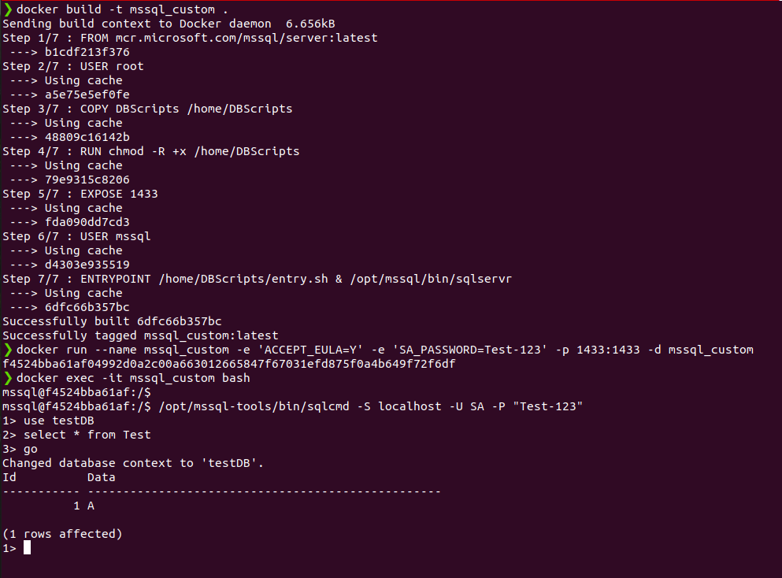

#Question-1

1. Write a Docker Script to perform the following actions.  
    • Download the Docker image for SQL Server Developer Edition  
    • Have a folder called DBScripts in the Docker root container where all the SQL Server Database scripts are present  
    • The .sql file in the DBScripts folder should run in Ascending order in the Database when the Docker image is built  
    • The SQL Server Developer edition should be exposed to the Docker host machine so that the Reporting tools / SSMS can connect to it from the host machine  

#####Command to build the image and create container-  

docker build -t mssql_custom .  
docker run --name mssql_custom -e 'ACCEPT_EULA=Y' -e 'SA_PASSWORD=Test-123' -p 1433:1433 -d mssql_custom  

#####Sample Run

