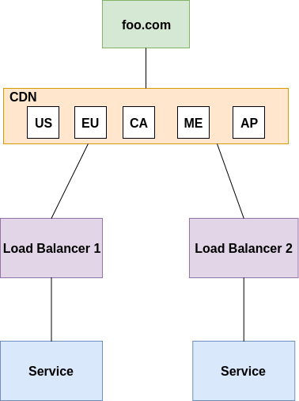

#Question-2

We have a high availability application running with the following Architecture.  

**Explain the Architecture model of this and the Benefit**  
This looks like an active-active DR strategy. The LB1 & LB2 could be registered on a VIP which redirects traffic based on the strategy set like round-robin. The benefit of this architecture is that even if one of the LB goes down, the traffic will be routed to the other LB. This is mostly taken care of by the VIP.

**How do you roll out an update to the service without any downtime impact to the app foo.com**  
To rollout update to this architecture without any downtime, we may have to deregister one of the LB from the VIP while the other one is serving traffic, perform the upgrade and register it back again. Similarly, deregister the second one and perform the upgrade and register it back again.  

**If you have to deploy this App to the Cloud what services would you use and explain the Architecture. You can mention for Cloud of your choice (AWS / Amazon / Google Cloud (GCP) / Oracle / Alibaba Cloud)**  
Current architecture has only one instance of the service, instead we can have multiple instances of the service created via deployment object. Expose it as a service, and create a ingress object. Since services too load-balance between the available pods hence the problem of availablility will be solved. Also, the ingress can be registered in the VIP. The biggest problem that this approach will solve is the rolling upgrade of the service (provided by deployment object) and a Highly available infrastructure. For this, we can make use of AWS EKS service. EKS will give us a managed kubernetes cluster. Then configuring aws cli, kubectl tool and the kubeconfig should make the cluster available. Finally applying the manifest files(deployment, service, ingress) will setup the application for us.