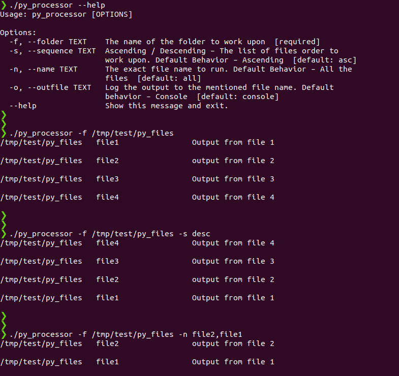

#Question-3

2. Write a Python program to build an automated Data Pipeline. The program should be a single file python code and should be able to do the following.  
    a. Navigate to a particular folder and execute other Python scripts which contains some kind of Data Ingestion / Transformation  

    b. Take the following as command line input (bash style preferred)  
        i. A folder name – Mandatory - The name of the folder to work upon  
        ii. Script Order – Optional - Ascending / Descending – The list of files order to work upon. Default Behavior – Ascending  
        iii. File name – Optional – The exact file name to run. Default Behavior – All the files  
        iv. Outfile – Optional – Log the output to the mentioned file name. Default behavior – Console  
        v. Help – Optional  - Display the help and usage information  
    
    c. The following should be displayed as Output (beautification / Table preferred)  
        i. The Folder where it is executed  
        ii. The file/files it is executed (in the order of execution)  
        iii. The output of the files executed. Just the console output returned should be okay  

####Sample Run-

